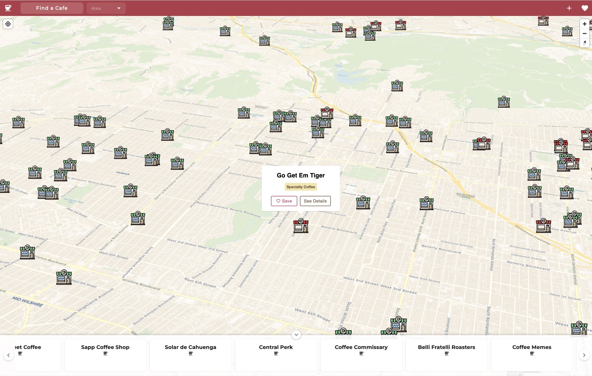
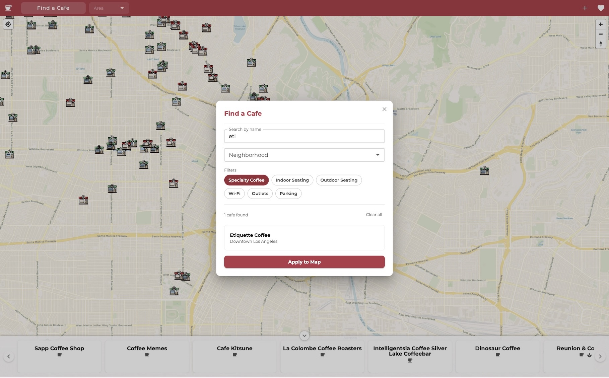
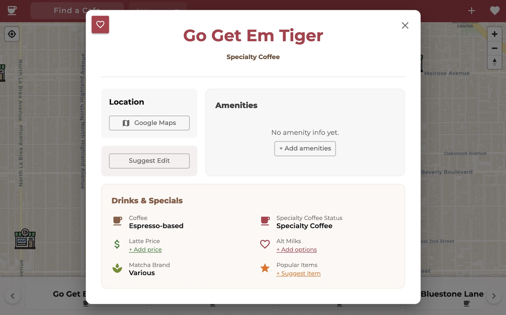

# React + JS/TS + PostgreSQL

# Coffeeshop Map

An interactive map for coffeeshops to explore, filter, and save spots across Los Angeles neighborhoods.
Coffeeshop Map lets you browse LA cafes on an interactive map, search by name, filter by features like specialty coffee, wi-fi, or outdoor seating, and explore by neighborhood. Cafe details are shown in popups, and a bottom scroller lets you browse what's in view.

## Tech Stack

- **Frontend:** React, TypeScript, JavaScript, Material UI
- **Geo:** MapLibre, Turf.js
- **State:** Zustand
- **Backend:** Node.js / Express
- **Database:** PostgreSQL

